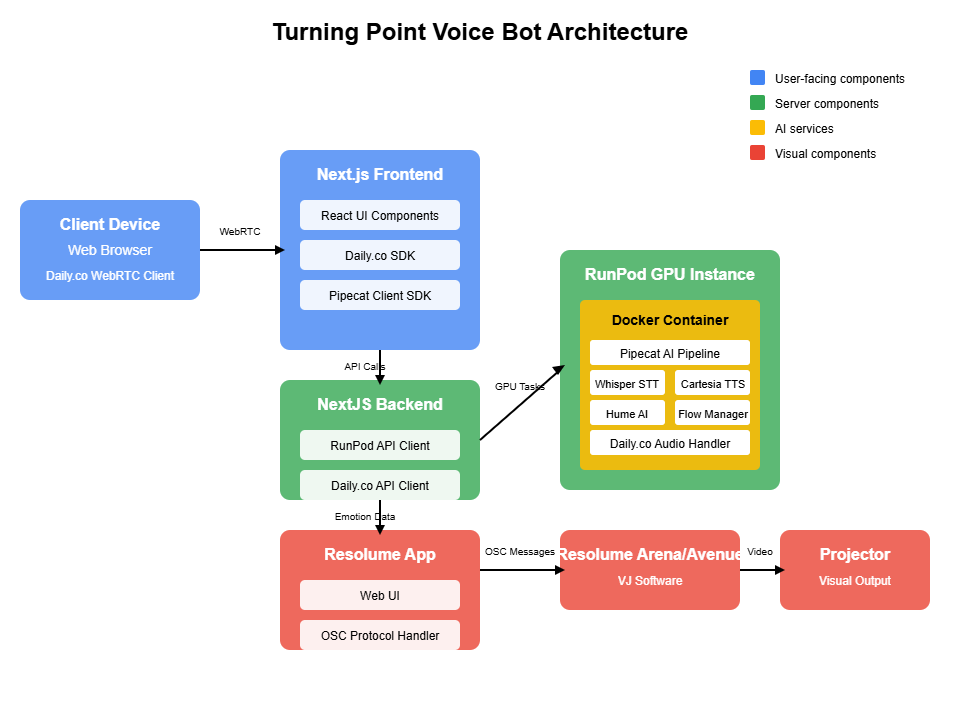

# AVA Voice Bot

A sophisticated conversational AI platform with real-time emotion analysis and guided conversations.

## Overview

The AVA Voice Bot combines cutting-edge voice processing, emotion analysis, and conversational AI to create an immersive and responsive voice interaction experience. The system analyzes users' emotional states in real-time while guiding them through transformative conversations.



## Key Features

- **Real-time Voice Conversations** - Natural speech interactions using advanced STT and TTS
- **Emotion Analysis** - Live tracking and response to user emotional states using Hume AI
- **Guided Conversations** - Structured conversation pathways with adaptive responses
- **Multi-platform** - Web interface with support for various devices
- **GPU Acceleration** - High-performance processing using NVIDIA CUDA
- **Multiple TTS Voices** - Choice of voice styles and emotions through various providers
- **Resolume VJ Integration** - Control Resolume Arena/Avenue visual performances via OSC protocol based on conversation content and emotional states

## Project Structure

The project consists of two main components:

### Backend (Python)

The backend is built with Python and uses FastAPI to provide an API for the frontend. It manages the bot instances and handles audio processing, speech recognition, and conversation management.

- **Technologies**: Python, FastAPI, Pipecat SDK, Hume AI, Docker
- **Deployable**: As a Docker container with NVIDIA GPU support
- [Backend Documentation](backend/README.md)

### Frontend (Next.js)

The frontend is built with Next.js and React, providing a modern web interface for interacting with the Turning Point Voice Bot. It handles user authentication, audio streaming, and UI updates based on the conversation state.

- **Technologies**: Next.js, React, Daily.co SDK, Pipecat Client SDK
- **Features**: Voice selection, emotion visualization, conversation history
- [Frontend Documentation](frontend-next/README.md)

## Getting Started

### Prerequisites

- Node.js 18+ and npm/yarn (for frontend)
- API keys for:
  - Daily.co
  - OpenAI
  - Hume AI
  - Cartesia or other TTS providers
  - Fish Audio

### Quick Start

1. **Set up the backend**:
```bash
cd backend
python -m venv venv
source venv/bin/activate  # On Windows: venv\Scripts\activate
pip install -r requirements.txt
```

2. **Start the backend server**:
```bash
cd backend/src/ava-bot
python server.py
```

3. **Set up the frontend**:
```bash
cd frontend-next
npm install
# Create .env.local file with your configuration
```

4. **Start the frontend development server**:
```bash
cd frontend-next
npm run dev
```

5. **Access the application**:
   Open [http://localhost:3000](http://localhost:3000) in your browser

## Architecture

The AVA Voice Bot uses a modern, distributed architecture:

1. **User Interface Layer** (Frontend)
   - Next.js web application
   - WebSocket connections for real-time communication
   - Daily.co integration for audio transport

2. **API Layer** (Backend Server)
   - FastAPI server managing bot instances
   - Daily.co room creation and management
   - Status monitoring and logging

3. **Bot Instance Layer** (Backend)
   - Pipecat Pipeline for audio processing
   - Whisper STT for speech recognition
   - OpenAI GPT models for language processing
   - Cartesia/ElevenLabs/OpenAI TTS for voice synthesis
   - Hume AI for emotion analysis

4. **Deployment Options**
   - Local development with Docker
   - Cloud deployment with RunPod


## Development

### Adding New Features

- **Conversation Flows**: Extend the Flow Manager in the backend
- **UI Components**: Add React components to the frontend
- **Voice Options**: Configure additional TTS providers and voices
- **Emotion Analysis**: Enhance the emotion processing pipeline

### Contributing

Contributions are welcome! Please feel free to submit a Pull Request.

## License

This project is licensed under the BSD 2-Clause License - see the LICENSE file for details.

## Acknowledgements

- [Pipecat](https://pipecat.ai/) - For the audio processing pipeline SDK
- [Hume AI](https://hume.ai/) - For emotion analysis capabilities
- [Daily.co](https://daily.co/) - For audio/video room infrastructure
- [OpenAI](https://openai.com/) - For language models and speech recognition
